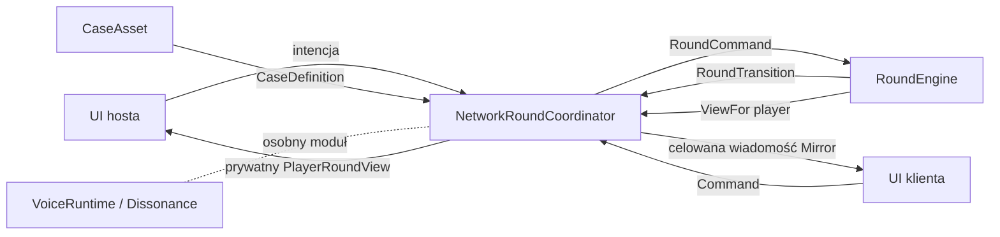

# Architektura pierwszego vertical slice'a

## Cel

Pierwszy slice ma pozwolić 4–6 graczom połączyć się lokalnie, rozpocząć Rundę, otrzymać prywatne role i wersje Alibi, przejść przez Przygotowanie, swobodnie poruszać się podczas wspólnego Limitu Rundy oraz zakończyć rozgrywkę jedną Egzekucją albo upływem czasu.

Poza pierwszym slice'em pozostają: Prywatne Cele, Incydenty, Plan Ucieczki, Tropy do Alibi, finalna forma Notatek Detektywa, docelowa biblioteka contentu, dopracowana broń i prezentacja wyników. Bunt jest zatwierdzonym skutkiem emergentnym indywidualnych interesów graczy, a nie osobnym systemem do implementacji. Rozszerzenie po slice opisuje specyfikacja [Prywatnych Celów, Incydentów i Ucieczki](../design/mechanics/prywatne-cele-incydenty-i-ucieczka.md). Głos Przestrzenny jest osobnym spike'em integracyjnym opisanym w [researchu narzędzi](../research/proximity-voice-tools.md).

## Playground po pivocie

Scena `Room` pozostaje technicznym playgroundem, a nie prezentacją docelowej pętli Rundy. Widoczny jest wyłącznie developerski launcher sieciowy potrzebny do prostego uruchomienia hosta i klienta. Pickup broni, strzelanie oraz integracja Vivox pozostają w kodzie i scenie jako działające spike'i, ale nie są jeszcze podpięte do reguł Rundy. Docelowo Detektyw otrzymuje pistolet od początku Rundy; obecny ogólnodostępny pickup nie jest zatwierdzonym przepływem gameplayowym.

Canvas z ikoną stanu mikrofonu jest domyślnie ukryty, a komponenty `VivoxTest` i `NetworkRoundCoordinator` są wyłączone w scenie. To celowa decyzja produktowa, nie sygnał do usunięcia voice chatu ani Rundy. Można je ponownie włączyć dopiero po skonfigurowaniu projektu Unity/Vivox i uzgodnieniu przepływu Rundy. Do lokalnego uruchamiania playgroundu można wymusić KCP argumentem `-force-kcp`, bez usuwania istniejącej ścieżki Steam/FizzySteamworks.

## Moduły

### `RoundEngine`

Czysty moduł C# zawierający wszystkie reguły Rundy. Nie zna Unity, Mirror, Steamworks, scen, UI ani Dissonance.

Jego mały interfejs:

```csharp
RoundTransition Handle(RoundCommand command);
PlayerRoundView ViewFor(PlayerId viewer);
```

`RoundCommand` obejmuje tylko intencje zmieniające stan, początkowo: rozpoczęcie Rundy, zakończenie Przygotowania, Egzekucję i upływ Limitu Rundy. `RoundTransition` zwraca nowy publiczny stan i zdarzenia do rozesłania; moduł sam nie wykonuje efektów ubocznych. `PlayerRoundView` jest jedyną drogą odczytu informacji przez klienta i filtruje je według roli oraz fazy.

Interfejs gwarantuje:

- dokładnie jednego Detektywa i jednego Winnego w poprawnym Składzie Rundy;
- pełne Alibi dla Niewinnych, zredagowane dla Winnego i brak Alibi dla Detektywa;
- niedostępność Alibi po Przygotowaniu;
- najwyżej jedną Egzekucję;
- jednoznaczne rozliczenie Egzekucji i Limitu Rundy;
- odrzucenie komendy niedozwolonej w bieżącym stanie.

### `NetworkRoundCoordinator`

Jeden adapter Mirror działający autorytatywnie na hoście. Mapuje połączenia Mirror na `PlayerId`, przekazuje zweryfikowane intencje do `RoundEngine` i wysyła każdemu klientowi wyłącznie jego `PlayerRoundView` przez celowaną wiadomość albo `TargetRpc`.

Adapter odpowiada za czas sieciowy, serializację i ponowne dostarczenie aktualnego widoku po dołączeniu lub zmianie fazy. Nie zawiera reguł przypisywania ról, redagowania Alibi ani rozstrzygania zwycięstwa.

### `CaseAsset`

ScriptableObject służący wyłącznie do authoringu ręcznie przygotowanych modułów Przestępstwa i Alibi. Przed rozpoczęciem Rundy zamienia dane Unity na niezmienny `CaseDefinition`, który trafia do `RoundEngine`.

Nie tworzymy teraz osobnego interfejsu katalogu spraw. Testy przekazują zwykły `CaseDefinition`, a runtime korzysta z `CaseAsset`; to wystarcza bez dodatkowej warstwy abstrakcji.

### `RoundPresenter`

Lokalny moduł UI renderujący otrzymany `PlayerRoundView`: rolę, jawne Przestępstwo, odpowiednią wersję Alibi w Przygotowaniu, Limit Rundy i wynik. Może wysyłać intencje gracza do adaptera Mirror, ale nie interpretuje reguł ani nie przechowuje sekretów innych graczy.

### `VoiceRuntime`

Osobny moduł integracyjny dla Dissonance i akustyki drzwi. Korzysta z pozycji już synchronizowanych przez Mirror, ale nie zależy od `RoundEngine`. Pierwszy model akustyczny steruje per mówca głośnością i filtrem dolnoprzepustowym na podstawie dystansu, pomieszczeń i stanu drzwi.

Nie wystawiamy jeszcze ogólnego interfejsu dostawcy voice: dopóki istnieje tylko jeden adapter, byłby to hipotetyczny seam bez wartości.

## Przepływ danych



## Układ plików

```text
Assets/Scripts/Game/
  Domain/
    RoundEngine.cs
    RoundCommand.cs
    RoundTransition.cs
    PlayerRoundView.cs
    CaseDefinition.cs
  Content/
    CaseAsset.cs
  Networking/
    NetworkRoundCoordinator.cs
    RoundMessages.cs
  UI/
    RoundPresenter.cs
  Voice/
    VoiceOcclusion.cs
```

`Domain` powinno dostać własny assembly definition bez zależności od Unity i Mirror. Runtime może mieć drugi assembly definition zależny od `Domain`, Mirror i Unity. Edit Mode tests testują `RoundEngine` przez jego interfejs; nie testują jego pól ani wewnętrznych klas.

## Minimalne testy modułu Rundy

1. Poprawny Skład Rundy zawsze ma jednego Detektywa i jednego Winnego.
2. Każdy gracz otrzymuje wyłącznie dozwolone informacje.
3. Winny widzi dokładnie skonfigurowane braki w Alibi.
4. Po Przygotowaniu żaden Podejrzany nie otrzymuje treści Alibi.
5. Egzekucja Winnego daje zwycięstwo Detektywowi.
6. Egzekucja Niewinnego daje przegraną Detektywowi i kończy Rundę.
7. Druga Egzekucja oraz komendy po zakończeniu Rundy są odrzucane.
8. Upływ Limitu Rundy bez Egzekucji kończy Rundę przegraną Detektywa.

## Kolejność implementacji

1. `Domain` wraz z Edit Mode tests i jedną stałą `CaseDefinition`.
2. `CaseAsset` z jedną testową Sprawą.
3. `NetworkRoundCoordinator` na obecnym KCP, żeby testować hosta i klientów lokalnie.
4. Minimalny `RoundPresenter`: Start, karta Przygotowania, timer i ekran wyniku; cel Egzekucji wyznacza fizyczne trafienie z pistoletu.
5. Test dwóch klientów przez ParrelSync.
6. Osobny spike Dissonance na KCP, następnie test na dwóch kontach przez FizzySteamworks.
7. Dopiero po udanym slice'ie: [Prywatne Cele, Incydenty i Ucieczka](../design/mechanics/prywatne-cele-incydenty-i-ucieczka.md), Notatki Detektywa, Fizzy jako domyślny transport i dalszy content.
