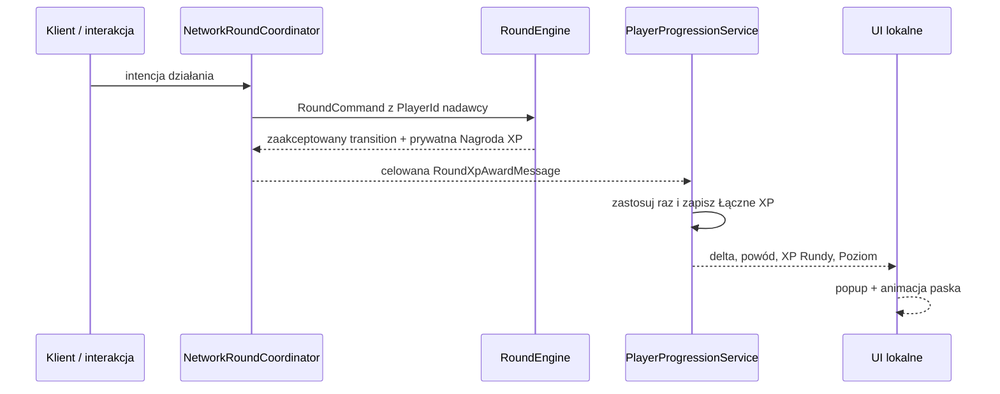

# Specyfikacja: widoczne XP, `Punkty Rundy` i leaderboard lobby

**Status:** nowa decyzja produktowa z rozmowy, gotowa do implementacji pierwszego przyrostu

**Data:** 2026-08-21

**Cel handoffu:** po dołączeniu tego pliku kolejna sesja ma zaimplementować opisany przyrost bez ponownego wywiadu. Wartości oznaczone jako robocze są konfigurowalnym balansem, a nie nowymi stałymi kanonu.

## 1. Problem i oczekiwany rezultat

Obecna `Runda` poprawnie rozstrzyga role, `Prywatne Cele`, `Incydenty`, `Tropy do Alibi`, `Ucieczkę` i `Egzekucję`, ale wiele poprawnych działań daje graczowi zbyt słabą natychmiastową odpowiedź. Gracze potrzebują częstszych mikro-nagród oraz widocznego poczucia progresu podczas wykonywania czynności.

Pierwszy przyrost ma stworzyć następującą pętlę:

> zaakceptowane działanie → prywatny popup `+XP` → animacja postępu → zapis XP → podsumowanie w `Aktach Rundy` → leaderboard sesji w lobby

System ma:

- natychmiast i czytelnie nagradzać aktywność podczas `Rundy`;
- dawać każdej roli własne źródła XP;
- wzmacniać wykonywanie istniejących działań bez ujawniania sekretów;
- zapewniać satysfakcjonujące podsumowanie nawet graczowi, który przegrał;
- budować trwały level gracza oraz krótkoterminową rywalizację w aktualnym lobby;
- pozostawić bez zmian warunki zwycięstwa i wszystkie zatwierdzone zasady `Rundy`.

System XP jest warstwą feedbacku i progresji. Nie zastępuje osobnego redesignu głównej pętli opisanego w [analizie rdzenia gry](../../research/2026-08-21-core-loop-and-replayability.md) i w tym przyroście nie dodaje nowych globalnych wydarzeń.

## 2. Źródła i status decyzji

### 2.1. Zatwierdzone wcześniej

- Skład, role, `Alibi`, `Prywatne Cele`, `Incydenty`, `Ucieczka`, `Limit Rundy`, jedna `Egzekucja` i indywidualne wyniki pozostają zgodne z [`CONTEXT.md`](../../../CONTEXT.md).
- Reguły `Rundy` rozstrzyga czysty `RoundEngine`; Unity UI i Mirror nie rozstrzygają wyniku ani XP ([`MVP-ARCHITECTURE.md`](../../architecture/MVP-ARCHITECTURE.md)).
- Host posiada role, cele, autorów działań i pozostałe sekrety, a klient otrzymuje wyłącznie swój prywatny widok lub celowaną wiadomość ([ADR-0011](../../adr/0011-server-owns-secrets-and-exposes-private-views.md)).
- `Niewinni` mają indywidualne wyniki i nie tworzą jednej drużyny punktowej ([ADR-0013](../../adr/0013-private-goals-and-emergent-rebellion.md)).
- Widoczne działania nie mogą systemowo potwierdzać roli ani motywu ([ADR-0014](../../adr/0014-readable-actions-ambiguous-motives.md)).
- UI `Rundy` korzysta z Unity UI Toolkit i metafory policyjnych akt; środek ekranu pozostaje wolny ([`UI-STYLE-GUIDE.md`](../ui/UI-STYLE-GUIDE.md)).
- Po zakończeniu `Rundy` wolno ujawnić role, cele, autorów `Incydentów`, działania `Ucieczki` i indywidualne wyniki. Ujawnienie pełnego `Alibi` nadal pozostaje otwarte ([`OPEN-QUESTIONS.md`](../OPEN-QUESTIONS.md)).

### 2.2. Nowe decyzje z tej rozmowy

- Gracz otrzymuje widoczny feedback punktowy natychmiast po zaakceptowanym działaniu, a nie dopiero po `Rundzie`.
- Feedback podczas `Rundy` jest prywatny: tylko zdobywający widzi kwotę, powód, bieżący wynik i ewentualny awans.
- Punkty są indywidualne i zależne od roli; nie istnieje wspólny wynik `Niewinnych`.
- XP może wynikać z wykonania zadania, postępu właściwego dla roli, udziału w rozstrzyganej akcji i pochwały `Detektywa`.
- `Detektyw` może podczas `Rundy` przyznać ograniczoną liczbę `Pochwał Detektywa`; wskazany gracz natychmiast otrzymuje XP.
- Ekran końcowy pokazuje `Akta Rundy`: XP każdego gracza, rozbicie źródeł XP, role i istniejące ujawnienie przebiegu.
- Lobby utrzymuje leaderboard XP zdobytego od utworzenia bieżącej sesji lobby.
- Gracz ma trwałe `Łączne XP` i `Poziom`, które pozostają po zamknięciu gry.
- Punkty i level nie zapewniają przewagi mechanicznej w `Rundzie`.

### 2.3. Robocze decyzje pierwszego przyrostu

Poniższe wartości pozwalają wdrożyć i przetestować feature bez blokującego pytania. Muszą pozostawać zebrane w jednym miejscu i łatwe do zmiany:

- start od `Poziomu 1` i `0 XP`;
- `100 XP` na każdy kolejny poziom: `Poziom = 1 + floor(Łączne XP / 100)`;
- `2 Pochwały Detektywa` na `Rundę`;
- jedna osoba może otrzymać najwyżej jedną pochwałę w tej samej `Rundzie`;
- w pierwszym przyroście wszystkie domyślne nagrody są dodatnie;
- XP zapisuje się lokalnie na urządzeniu po każdej serwerowo przyznanej nagrodzie;
- leaderboard sesji resetuje się wraz z zakończeniem/rozwiązaniem lobby, ale nie przy powrocie z wyniku do tego samego lobby;
- pierwszy przyrost używa jednego lokalnego profilu progresji na instalację. Steam Cloud, Steam Stats i synchronizacja między urządzeniami są poza zakresem.

## 3. Terminy feature’a

**Nagroda XP**

Jednorazowy, serwerowo rozstrzygnięty wpis zawierający odbiorcę, dodatnią wartość, stabilny powód, identyfikator/sekwecję oraz nową sumę XP zdobytego w bieżącej `Rundzie`.

**XP Rundy**

Suma nagród zdobytych przez danego gracza od rozpoczęcia bieżącej `Rundy`. Jest prywatna podczas gry i publiczna po jej zakończeniu.

**XP Sesji**

Suma XP zdobytego przez gracza we wszystkich zakończonych i bieżących `Rundach` w aktualnym lobby. Służy do leaderboardu lobby.

**Łączne XP**

Trwała lokalna suma XP gracza używana do wyliczenia `Poziomu`.

**Pochwała Detektywa**

Ograniczona, prywatna podczas `Rundy` nagroda przyznana Podejrzanemu przez `Detektywa` za pomoc, zeznanie albo współpracę. Nie potwierdza prawdziwości informacji i może trafić także do `Winnego`.

**Akta Rundy**

Końcowe, publiczne podsumowanie zdobytego XP i jego źródeł, dołączone do istniejącego ujawnienia ról, działań i indywidualnych wyników.

## 4. Wymagane zachowanie

### 4.1. Natychmiastowe przyznawanie i feedback

1. XP przyznaje wyłącznie host po zaakceptowaniu działania przez domenę. Klient nigdy nie wysyła ogólnej intencji typu `Dodaj XP` ani nie nalicza nagrody na podstawie samej animacji lub lokalnego sukcesu minigry.
2. Odrzucona, anulowana, powtórzona lub nieskończona czynność nie przyznaje XP.
3. Każdy jednorazowy krok, Trop, odkrycie lub etap `Ucieczki` może przyznać swoją nagrodę najwyżej raz.
4. Odbiorca od razu widzi lokalny popup:

   ```text
   +10 XP
   Odkryto Cichy Incydent
   ```

5. Ten sam popup nie jest widoczny nad postacią, w świecie ani na ekranach innych graczy.
6. HUD pokazuje mały licznik `XP Rundy: N` oraz pasek bieżącego `Poziomu`. Przekroczenie progu poziomu pokazuje jednorazowy komunikat `AWANS — POZIOM N`.
7. Kilka szybko następujących nagród trafia do kolejki; żadna nie ginie ani nie zasłania środka ekranu. Popupy pojawiają się w prawym górnym rogu, pod kompaktowym panelem XP.
8. Tekst nagrody opisuje wykonane działanie, ale nie potwierdza prawdy, roli ani motywu. Dozwolone jest `Złożono zeznanie`; niedozwolone jest `Powiedziano prawdę`.
9. Dźwięk nagrody jest lokalny i niespatializowany. Jeżeli repo nie ma odpowiedniego, legalnego klipu UI, brak nowego audio nie blokuje przyrostu; wymagane pozostają animacja i czytelna zmiana wartości.

### 4.2. Początkowy katalog nagród

Wartości są roboczym balansem, ale identyfikatory powodów i warunki przyznania są częścią kontraktu pierwszego przyrostu.

| Powód | Odbiorca | Warunek | XP |
|---|---|---|---:|
| `PrivateObjectiveStepCompleted` | `Niewinny` | zaakceptowano niekońcowy, unikalny krok jego `Prywatnego Celu` | 10 |
| `PrivateObjectiveCompleted` | `Niewinny` | zaakceptowany krok właśnie ukończył jego `Prywatny Cel`; nie doliczać równocześnie nagrody za zwykły krok | 20 |
| `QuietIncidentDiscovered` | `Detektyw` | osobiście odkrył wcześniej nieodkryty `Cichy Incydent` | 10 |
| `AlibiClueAcquired` | `Winny` | zdobył unikalny `Trop do Alibi` | 10 |
| `EscapeStepPrepared` | `Winny` | zaakceptowano unikalny krok przygotowania `Planu Ucieczki` | 10 |
| `DetectiveCommendation` | wskazany Podejrzany | `Detektyw` skutecznie zużył Pochwałę na tej osobie | 10 |
| `RoundCompleted` | każdy uczestnik | `Runda` została rozstrzygnięta przez `Egzekucję`, `Limit Rundy` albo `Ucieczkę` | 20 |
| `RoleWon` | indywidualny zwycięzca | istniejący `PlayerResultView.Won` jest prawdziwy | 30 |
| `CorrectExecution` | `Detektyw` | `Egzekucja` trafiła `Winnego` | 20 |
| `SuccessfulEscape` | `Winny` | skuteczna `Ucieczka` zakończyła `Rundę` | 20 |

Nagrody końcowe (`RoundCompleted`, `RoleWon`, `CorrectExecution`, `SuccessfulEscape`) są zapisywane jako osobne pozycje w rozbiciu, ale UI może zsumować je w jeden popup `Wynik Rundy`, aby nie wyświetlać trzech komunikatów naraz.

Nie przyznawać osobnego XP za lokalne ukończenie minigry, jeśli ten sam sukces prowadzi do nagradzanego kroku domenowego. Unikamy podwójnego naliczenia za jedno działanie.

### 4.3. `Pochwały Detektywa`

1. Tylko aktualny `Detektyw` może wysłać intencję Pochwały i tylko podczas fazy `Runda`.
2. Celem może być żyjący Podejrzany należący do bieżącego `Składu Rundy`; `Detektyw` nie może nagrodzić siebie.
3. `Detektyw` ma roboczo dwie Pochwały na `Rundę`, a jednego gracza może pochwalić tylko raz.
4. Odbiorca natychmiast widzi `+10 XP — Pochwała Detektywa`. Pozostali nie otrzymują tej informacji podczas `Rundy`.
5. Pochwała nie staje się dowodem niewinności. Jeśli otrzymał ją `Winny`, XP pozostaje ważne; końcowe `Akta Rundy` mogą opisać to jako zdobycie zaufania `Detektywa`.
6. Minimalny interfejs nie rozstrzyga finalnej formy `Notatek Detektywa`. W istniejącym, zwijanym panelu `Detektywa` należy dodać sekcję `Pochwały` z listą Podejrzanych, przyciskiem `+` i licznikiem pozostałych Pochwał.
7. Przycisk zużywa Pochwałę dopiero po akceptacji serwera; podwójne kliknięcie nie może przyznać dwóch nagród.

### 4.4. `Akta Rundy`

Po przejściu do `Finished` istniejący ekran wyniku zostaje rozszerzony o publiczną tabelę:

- nazwa gracza;
- ujawniona rola;
- wygrana/przegrana zgodna z istniejącym indywidualnym wynikiem;
- całkowite `XP Rundy`;
- rozbicie powodów i wartości;
- otrzymane `Pochwały Detektywa`;
- dla lokalnego gracza: wcześniejszy i nowy `Poziom`, pasek oraz komunikat awansu.

Tabela domyślnie sortuje graczy malejąco po `XP Rundy`, a remis rozstrzyga stabilna kolejność `PlayerId`. Wynik punktowy nie zastępuje werdyktu roli: gracz może przegrać `Rundę`, lecz zdobyć dużo XP.

Pełne `Alibi` nie jest dodawane do `Akt Rundy`, ponieważ pozostaje osobną otwartą decyzją.

### 4.5. Leaderboard lobby i trwały level

1. Lobby pokazuje oddzielną sekcję `Wyniki sesji`, bez zmiany kolejności istniejącego rosteru gotowości.
2. Leaderboard sortuje po `XP Sesji` malejąco i pokazuje: miejsce, nazwę, `XP Sesji` oraz `Poziom`.
3. `XP Sesji` przechodzi między kolejnymi `Rundami` uruchamianymi w tym samym lobby i resetuje się po rozwiązaniu lobby.
4. Każdy klient przechowuje lokalnie własne `Łączne XP`; host otrzymuje je w publicznym profilu lobby wyłącznie do prezentacji poziomu.
5. Host jest autorytatywny dla nagród i `XP Sesji` w aktualnym lobby. Początkowe `Łączne XP` zgłoszone przez klienta jest w pierwszym przyroście traktowane jako publiczna informacja profilowa, nie jako bezpieczny ranking competitive.
6. `Poziom` jest wyliczany z `Łącznego XP`, nigdy przesyłany jako niezależna wartość mogąca rozjechać się z XP.
7. Simulowani gracze developerscy nie zapisują trwałego XP i są pomijani w leaderboardzie sesji.

## 5. Granice modułów i przepływ danych

### 5.1. `RoundEngine` — reguły i ledger `XP Rundy`

`RoundEngine` pozostaje jedynym źródłem decyzji, czy działanie zasługuje na nagrodę. Powinien posiadać:

- zamknięty katalog `RoundXpReason`;
- centralne `RoundXpRules` z roboczymi wartościami;
- hostowy ledger nagród per `PlayerId`;
- licznik zużytych `Pochwał Detektywa`;
- komendę domenową Pochwały;
- domenowe zdarzenie nagrody z odbiorcą, wartością, powodem, sekwencją i nową sumą;
- prywatny widok własnego `XP Rundy`;
- pełny score reveal dostępny wszystkim dopiero po `Finished`.

Wymagany jest prywatny seam zdarzeń lub funkcjonalnie równoważne rozwiązanie. `RoundEvent.XpAwarded` nie może zostać potraktowany jak publiczny broadcast: `NetworkRoundCoordinator` kieruje go wyłącznie do połączenia odbiorcy. Nazwa typu może zostać dopasowana do istniejącego modelu, ale prywatność i dokładnie-jednokrotna prezentacja są wymagane.

`RoundEngine` nadal nie zna Unity, Mirror, PlayerPrefs, dźwięku ani animacji.

### 5.2. `NetworkRoundCoordinator` — autorytet i celowana dostawa

Adapter Mirror:

- mapuje nadawcę Pochwały na `PlayerId`; klient nie przesyła własnej tożsamości;
- przekazuje intencję do `RoundEngine`;
- wysyła `RoundXpAwardMessage` wyłącznie odbiorcy;
- rozsyła publiczne końcowe `Akta Rundy` dopiero po `Finished`;
- utrzymuje hostowy licznik `XP Sesji` dla aktualnych połączeń;
- rozszerza publiczny profil i stan lobby o `Łączne XP`/wyliczony `Poziom` oraz `XP Sesji`;
- nie synchronizuje powodów ukrytych nagród przez globalne `SyncVar`.

Wiadomość nagrody musi mieć stabilny identyfikator lub rosnącą sekwencję, aby UI i lokalny zapis nie zastosowały tego samego awardu dwukrotnie.

### 5.3. Progresja lokalna — poza `RoundEngine`

Trwała progresja nie jest regułą pojedynczej `Rundy`. W `InterrogationRoom.Game` należy dodać mały moduł:

```text
ProgressionRules          — czyste wyliczenie Poziomu i postępu
PlayerProgression         — Łączne XP oraz wersja danych
IPlayerProgressionStore   — seam zapisu/odczytu
PlayerPrefsProgressionStore — pierwszy lokalny adapter
PlayerProgressionService  — dokładnie-jednokrotne zastosowanie nagrody i publikacja zmiany UI
```

Nie używać `GameSettingsService` jako właściciela progresji: ustawienia i postęp gracza mają inny cykl życia. Dane muszą mieć numer wersji, brakujące/uszkodzone wartości wracają bezpiecznie do `0 XP`, a wartości ujemne są clampowane do zera.

### 5.4. UI

- `RoundPresenter` renderuje prywatny licznik, kolejkę popupów, awans i `Akta Rundy`, ale nie wylicza przyznanych wartości.
- `LobbyCharacterPresenter` albo mały współpracownik lobby renderuje oddzielny leaderboard na podstawie publicznego stanu lobby; nie sortuje ani nie przebudowuje głównej listy gotowości według XP.
- Wszystkie napisy mają wersję polską i angielską przez `UiText`.
- Popup używa grafitowego panelu, bursztynowego akcentu i animacji wejścia około `220 ms`; nie używa czerwieni ani animacji zapętlonej.
- Centralne `50% × 50%` obrazu pozostaje wolne. Panel XP mieści się w prawym górnym rogu z marginesem zgodnym z przewodnikiem UI.
- Nowe elementy UXML/USS należy zmieniać przez zwykłe pliki UI; operacji scenowych lub przypisania assetów wymagających Editora nie wolno zastępować ręczną edycją YAML.

### 5.5. Przepływ



## 6. Kryteria akceptacji

1. Zaakceptowany, unikalny krok `Prywatnego Celu` daje właścicielowi dokładnie jedną właściwą nagrodę i natychmiastowy prywatny popup.
2. Powtórzona, odrzucona albo anulowana intencja nie zmienia `XP Rundy`, `XP Sesji` ani `Łącznego XP`.
3. `Detektyw` może przyznać dwie Pochwały różnym Podejrzanym; trzecia, druga dla tej samej osoby, Pochwała siebie oraz Pochwała wysłana przez inną rolę są odrzucane bez XP.
4. Pochwalony `Winny` otrzymuje tę samą nagrodę bez ujawnienia roli; podczas `Rundy` pozostali nie poznają Pochwały ani wyniku.
5. Zdobycie Tropu, przygotowanie kroku `Ucieczki` i odkrycie `Cichego Incydentu` nagradzają wyłącznie właściwego gracza i nie są globalnie synchronizowane.
6. Każda rola otrzymuje `RoundCompleted`, a tylko gracze z `PlayerResultView.Won` otrzymują `RoleWon`.
7. Poprawna `Egzekucja` oraz skuteczna `Ucieczka` przyznają właściwe premie dokładnie raz.
8. Dwie szybko otrzymane nagrody pokazują się kolejno, nie nadpisują się i nie blokują sterowania.
9. Przekroczenie wielokrotności `100 Łącznego XP` zwiększa `Poziom` dokładnie o właściwą liczbę i pokazuje jeden komunikat awansu dla każdego przekroczonego poziomu.
10. Ponowne uruchomienie klienta zachowuje `Łączne XP` i `Poziom`.
11. Po `Finished` każdy klient widzi tę samą publiczną tabelę `Akt Rundy`, zgodną z hostowym ledgerem, oraz istniejące indywidualne wyniki.
12. Powrót do tego samego lobby zachowuje `XP Sesji`; zamknięcie i utworzenie nowego lobby resetuje wyłącznie leaderboard sesji, nie `Łączne XP`.
13. Lobby pokazuje leaderboard oddzielnie od rosteru gotowości i nie ujawnia wcześniejszych ról ani prywatnych powodów przed końcem `Rundy`.
14. UI działa po polsku i angielsku, przy 1280×720, 1920×1080 i 4K; popupy nie zasłaniają timera, celownika, promptu interakcji ani panelu `Prywatnego Celu`.
15. Żaden klient nie może samodzielnie zwiększyć XP przez skonstruowanie ogólnej wiadomości punktowej albo lokalne wywołanie UI.

## 7. Testy i weryfikacja

### Edit Mode — `InterrogationRoom.Domain.EditModeTests`

- każdy powód XP i jego wartość;
- dokładnie-jednokrotne nagrody dla kroków, Tropów, `Ucieczki` i odkryć;
- nagrody końcowe dla wszystkich istniejących przyczyn zakończenia;
- ograniczenia `Pochwał Detektywa`;
- prywatny widok podczas `Rundy` i pełny reveal po `Finished`;
- brak zmiany stanu po odrzuconej intencji.

### Edit Mode — `InterrogationRoom.Game.Networking.EditModeTests`

- mapowanie intencji Pochwały bez klientowskiego `PlayerId` nadawcy;
- serializacja wiadomości awardu, profilu lobby, leaderboardu i `Akt Rundy`;
- skierowanie prywatnego awardu wyłącznie do właściwego połączenia;
- kumulacja i reset `XP Sesji`;
- odrzucenie duplikatu sekwencji.

### Edit Mode — `InterrogationRoom.Game.UI.EditModeTests`

- model kolejki popupów i kolejność kilku nagród;
- teksty powodów PL/EN;
- obliczenie i prezentacja przekroczenia poziomu;
- sortowanie `Akt Rundy` i leaderboardu;
- stan Pochwał `2 → 1 → 0` i disabled po wyczerpaniu.

### Integracja Unity/Mirror

1. Uruchomić hosta i co najmniej jednego klienta na KCP/ParrelSync.
2. Przyznać nagrodę hostowi i klientowi; potwierdzić, że każdy widzi wyłącznie własny popup.
3. Jako `Detektyw` pochwalić Podejrzanego; sprawdzić prywatność oraz serwerowy limit.
4. Zakończyć `Rundę`; porównać `Akta Rundy` na obu klientach.
5. Wrócić do lobby; sprawdzić leaderboard sesji i levele.
6. Rozpocząć drugą `Rundę`; sprawdzić kumulację sesji.
7. Uruchomić klienta ponownie; sprawdzić trwałość `Łącznego XP`.
8. Sprawdzić Console pod kątem nowych Errors oraz wizualnie popup w 1080p i 4K.

Przed zakończeniem implementacji obowiązują testy wybranych asmdef-ów, kompilacja Unity, `git diff --check` oraz raport niewykonanych kroków. Test Steam/FizzySteamworks jest potrzebny dopiero po poprawnym KCP; Steam Cloud i Steam Stats nie są częścią tego przyrostu.

## 8. Kolejność implementacji

1. Czyste reguły XP, ledger i testy `RoundEngine`.
2. Komenda i reguły `Pochwały Detektywa`.
3. Prywatna wiadomość awardu, serializacja, hostowe `XP Sesji` i testy sieciowe.
4. Lokalny `PlayerProgressionService` oraz zapis PlayerPrefs z testowalnym seamem.
5. Prywatny HUD XP, kolejka popupów i awans.
6. `Akta Rundy` z publicznym rozbiciem wyników.
7. Leaderboard sesji i level w lobby.
8. KCP/ParrelSync, test dwóch kolejnych `Rund`, weryfikacja UI i Console.

## 9. Poza zakresem

- nowe globalne wydarzenia, dispatch board i implementacja `Żywej Sprawy`;
- zmiana warunków zwycięstwa którejkolwiek roli;
- rozpoznawanie mowy lub automatyczna ocena prawdziwości zeznań;
- XP za samo otwarcie panelu, spam interakcji, lokalny sukces minigry bez akceptacji domeny albo czas spędzony bez działania;
- publiczne popupy nad postaciami i live leaderboard podczas `Rundy`;
- odejmowanie XP i katalog kar za „intowanie”;
- kosmetyki, gameplayowe unlocki, waluty, sklep i battle pass;
- globalny/lifetime leaderboard, matchmaking rankingowy i anti-cheat profilu lokalnego;
- Steam Achievements, Steam Stats, Steam Cloud i migracja progresji między urządzeniami;
- finalna forma `Notatek Detektywa` oraz ujawnienie pełnego `Alibi`;
- trwałe rozstrzygnięcie XP po rozłączeniu kluczowej roli — zależy od istniejącego otwartego pytania o disconnect.

## 10. Otwarte decyzje po pierwszym przyroście

Nie blokują implementacji powyższego MVP:

- finalne wartości nagród i krzywa levelowania po playteście;
- czy późniejsze, jednoznacznie rozstrzygane globalne wydarzenia mogą odejmować niewielkie `Punkty Rundy`;
- jakie kosmetyki lub tytuły odblokowuje `Poziom`;
- czy `Pochwała Detektywa` ma później mieć kilka kategorii;
- czy trwała progresja przechodzi do Steam Stats/Cloud;
- czy leaderboard lifetime kiedykolwiek powstaje;
- czy w `Aktach Rundy` ujawniamy pełne `Alibi`.

## 11. Warunek ukończenia feature’a

Feature jest ukończony dopiero wtedy, gdy w rzeczywistej sieciowej `Rundzie` host i klient otrzymują prywatne, natychmiastowe nagrody za własne zaakceptowane działania, XP przetrwa ponowne uruchomienie klienta, końcowe `Akta Rundy` zgadzają się na obu klientach, a kolejne `Rundy` w tym samym lobby budują wspólny leaderboard sesji bez ujawnienia sekretów podczas gry.
