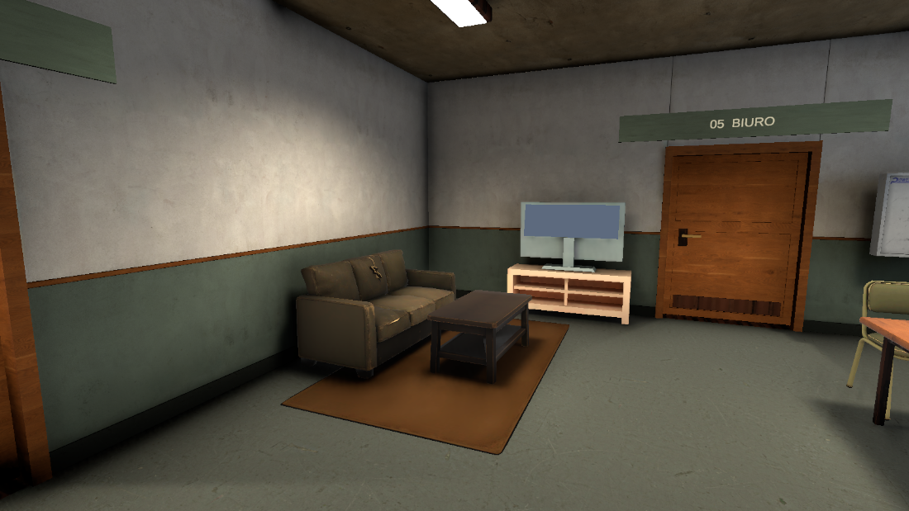

# Światło sali startowej

6 września 2026. Korekta wyłącznie oświetlenia sali wspólnej po uwadze użytkownika, że pozostałe pokoje wyglądają dobrze.

Dwie lampy przy środku sali zastąpiono układem czterech opraw: x ±3 m, z 7.9 oraz 11.55 m, na wysokości 3.18 m. Oświetlają osobno kanapy i stoliki przy oknach. Każda ma intensywność 32 zamiast wcześniejszych dwóch lamp po 58, stożek 150° z wewnętrznym kątem 80° oraz promień źródła 0.3 m dla miększych cieni wypalanych. Zachowano barwę światła, okna, ekspozycję i ustawienia innych pomieszczeń.

Zmiana jest odtwarzalna przez menu `Tools/Interrogation Room/Station Rebuild/19 Balance common room lighting` w `StationLayoutRefinement.cs`. Pełny builder układu również wywołuje tę konfigurację. Lampy są Baked, więc nie dodają dynamicznych cieni podczas gry. Nie wykonywano benchmarku FPS.

Kompilację początkowo zatrzymało okno Script Updating Consent. Przez Computer Use zaakceptowano aktualizację wyłącznie wskazanego pliku. Unity zastąpił przestarzałe `shadowRadius` przez `shapeRadius`; kompilacja zakończyła się bez błędów. Sesję Computer Use zresetowano i zwolniono sterowanie.

Pierwszy bake rozpoczęto o 00:43:20 i ukończono przed 00:56:44 czasu lokalnego. Wariant 48/110° został odrzucony po obejrzeniu zbyt mocnej plamy na ścianie nad kanapą. Pliki `common-light-after*.png` dokumentują ten wariant roboczy. Kolejny bake dotyczy poprawionego rozkładu 32/80°.

Warunki obrazów: Room, Edit Mode, bez Rundy, transportu, lokalnego gracza i HUD. Kamera MapOverviewCamera, pozycja (0.5, 1.65, 9.4), cel (-3.6, 1.05, 7.7). `common-light-before.png` pokazuje stan przed zmianą. Ocena wizualna bez porównania pikselowego i bez wniosków o wydajności.

Drugi bake rozpoczęto o 00:58:40 i ukończono przed 01:11:39. LightingData.asset zapisano o 01:10:57. Końcowe obrazy `common-light-final.png` i `common-light-final-entrance.png` obejrzano: mocna biała plama pierwszego wariantu zniknęła, a kanapa i sąsiednia ściana otrzymują więcej światła niż przed zmianą.

Unity zgłosił przejściowe błędy zapisu metadanych ReflectionProbe-1/2/3/4. Ponowny import tych czterech tekstur przez TextureImporter zakończył się poprawnie, wszystkie dziesięć sond ma przypisaną teksturę. Po wyczyszczeniu historycznych komunikatów i ponownym zapisie brak nowych Console Errors.

PASS: kompilacja, zapis sceny, oględziny dwóch końcowych renderów, walidacja dostępności sceny: 8 spawnów, 14 drzwi, 58 interakcji, 5758 osiągalnych pól. Play Mode i testów rozgrywki nie powtarzano, ponieważ zmiana obejmuje wyłącznie statyczne lampy i oprawy przy suficie. Multiplayer nie testowano zgodnie z poleceniem użytkownika.

