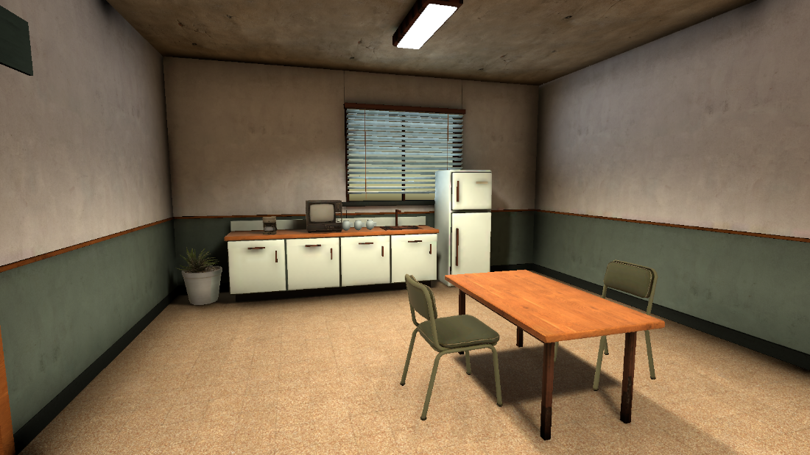
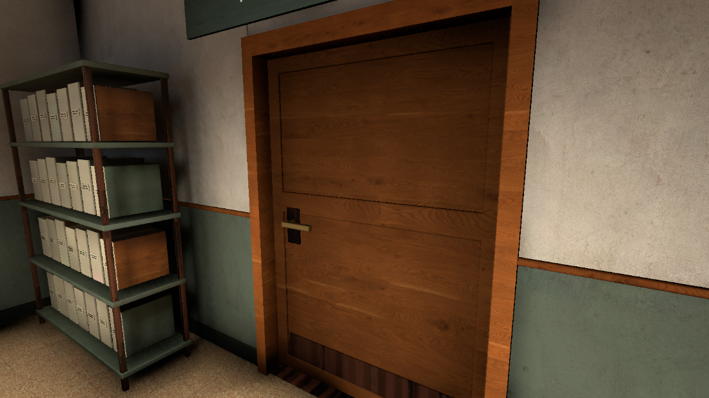
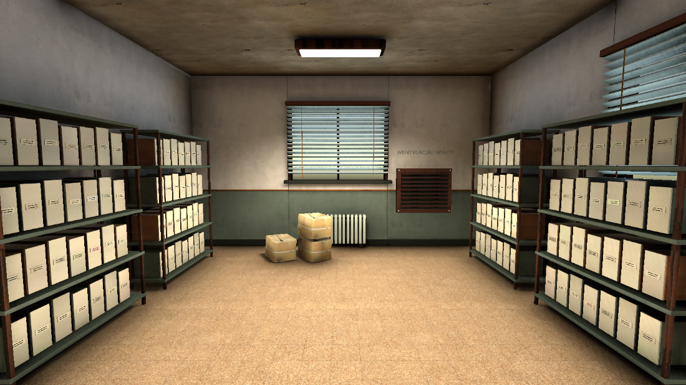

# Korekta układu i drzwi

Kontynuacja REALISM-PASS.md, 6 września 2026. Zakres wynika z uwag do warsztatu, socjalnego, magazynu, archiwum, biura, depozytu i sali startowej. Recepcja zachowuje poprzedni układ.

## Zmiany

- Wszystkie 14 drzwi wybiera kierunek otwierania na podstawie położenia gracza. Skrzydło obraca się wokół nieruchomego zawiasu przez całą animację. Programowe otwarcie zachowuje dotychczasowy wybór strony pomieszczenia.
- Nowe progi zamykają brak podłogi w otworach drzwiowych. Przy wejściu do warsztatu brakowało około 22,5 cm podłogi w poprzek grubości ściany. Pełne ościeżnice zasłaniają boczne prześwity. Ich powierzchnie mają różną głębokość względem starej ramy, aby uniknąć nakładania płaszczyzn.
- Socjalny ma ciąg kuchenny, lodówkę, dopasowany stół, dwie sąsiednie szafki i roślinę przy narożniku. Ekspres, radio i kubki stoją na blacie.
- Warsztat ma stół roboczy z szufladami i tablicą narzędziową, szafkę techniczną oraz dwa regały przy ścianie. Usunięto z widoku stary zestaw mebli, który zajmował to samo miejsce.
- Magazyn ma sześć regałów w dwóch rzędach i wolne przejście środkiem. Archiwum ma dodatkowe regały z segregatorami, poprawnie ustawiony telefon i nowy panel alarmu. Wskaźniki stanu są osadzone w panelach.
- Biuro ma nowe biurko, monitor i telefon, uporządkowane szafki oraz miejsce do siedzenia. Ławka w depozycie stoi bliżej ściany. Sala startowa ma stoły dopasowane do krzeseł, uporządkowane grupy wypoczynkowe, cienkie dywany na podłodze i mocniejsze światło praktyczne.
- Napisy roli i celu używają czytelnej czcionki zamiast wąskiego stempla. Karty mają większy tekst i odstępy. Tytuł zwiniętego celu zawija się w dostępnym miejscu i nie wypycha przycisku poza kartę. Powiązania UI i zasady Rundy pozostają dotychczasowe.

## Modele i odtwarzanie

W Blenderze wykonano 12 modeli: KitchenRun, StationFridge, StationDiningTable, StationArchiveRack, StationStaffLocker, StationWorkbench, StationAlarmPanel, StationOfficeDesk, StationMonitor, StationDeskPhone, StationThreshold i StationDoorLining. Źródło: `tools/station-rebuild/build_refined_furnishings.py`. Eksporty FBX są w `Assets/Art/Environment/StationRebuild/`. Modele mają fazowane krawędzie, UV i rozdzielone materiały; korzystają także z materiałów poprzedniego etapu.

Po eksporcie uruchom przez Unity MCP menu `Tools/Interrogation Room/Station Rebuild/16 Import refined furnishings`, następnie `17 Refine room layouts`, `Tools/Interrogation Room/Bake Chair Seats`, `7 Finalize player access` i `18 Final surface alignment`. Na końcu należy przeliczyć światło i occlusion oraz zapisać scenę Room. Nie uruchamiaj wcześniejszego zestawu ustawiającego skanowane meble po nowym układzie.

## Weryfikacja

- **PASS:** kompilacja Unity po zmianach C#; brak Console Errors w świeżej sesji singleplayer.
- **PASS:** 7 testów Play Mode dotyczących drzwi. Job `32c63524b56c44f597497c49015ebe6d`, 7 zaliczonych, 0 błędów, 0 pominiętych. Cztery warianty nowego testu sprawdzają obie strony oraz obrót drzwi 0/90 stopni.
- **PASS:** rzeczywista scena Room, Play Mode, lokalny gracz Niewinny, faza Round, developerski start solo, jedna lokalna instancja. Wszystkie 28 prób otwierania przez PlayerInteractor dało otwarcie od gracza, brak przesunięcia poziomego i przejście kontrolerem postaci na drugą stronę.
- **PASS z uwagą o podejściu:** 37 miejsc siedzących sprawdzonych przez PlayerInteractor. 36 zaakceptowało podejście z punktu wstawania. Prawe miejsce kanapy w biurze odrzuciło podejście przez podłokietnik; ponowiona próba od przodu, przy pozycji (-8, 0.04, 11.54), pozwoliła usiąść i przyjęła żądanie wstania. Statyczny walidator potwierdza wolne punkty wstawania. Surowe wyniki zachowują pierwsze odrzucenie w `layout-singleplayer-checks.json`.
- **PASS:** walidator sceny: 8 spawnów, 14 drzwi, 14 wolumenów pomieszczeń, 58 interakcji, 5758 osiągalnych pól siatki; dostępność, widoczność interakcji, punkty wstawania, progi i identyfikatory.
- **PASS:** 168 próbek bocznych krawędzi ościeżnic, po obu stronach wszystkich drzwi, bez pustego promienia.
- **PASS:** brak aktywnych rendererów nazwanych PLACEHOLDER i brak brakujących materiałów. RefinedFurnishings zawiera 52 instancje wyposażenia, progów i ościeżnic; interaktywne zamienniki zachowują własne dotychczasowe korzenie.
- **PASS:** zimny start UI, Przygotowanie, Round, rozwinięcie, zwinięcie i ponowne rozwinięcie celu. Zrzuty ScreenCapture obejmują rzeczywisty HUD.
- **PASS:** alarm uruchomiony przez PlayerInteractor w singleplayerze, jeden zarejestrowany Incydent; obejrzano aktywny panel bez lewitujących elementów.
- **Nie uruchomiono:** multiplayer zgodnie z poleceniem użytkownika, pełnych scenariuszy wszystkich celów oraz benchmarku samodzielnego Playera. Brak deklaracji osiągnięcia jakości AAA lub określonego FPS.

Odświeżenie AssetDatabase w trakcie jednej sesji walidacji spowodowało przeładowanie domeny i utratę lokalnego gracza oraz błędy inicjalizacji callbacków. Tę sesję przerwano. Ponowny zimny start, test alarmu i UI zakończyły się bez Console Errors. Nie zmieniano obsługi voice ani multiplayera.

## Końcowe oświetlenie i obrazy

Bake rozpoczęto o 00:10:16 i zakończono przed 00:23:46 czasu lokalnego 6 września. LightingData.asset zapisano o 00:22:59. Scena używa trzech map światła: 2048², 1024² i 256². Końcowa kompilacja i Console Errors przeszły bez błędów. Obrót dynamicznych kontrolek po bake nie zmienia statycznego oświetlenia; kontrolki nie rzucają cieni i korzystają z sond.

Obejrzano gotowe zrzuty `revision-final-*.png`: wejście do warsztatu, warsztat, socjalny, biuro, salę startową z obu stron, magazyn, archiwum i ławkę w depozycie. Przy wejściu do warsztatu zniknęła duża czarna plama po poprzednim ustawieniu wyposażenia. Dywany i progi przylegają do podłogi.

Zrzuty pomieszczeń: scena Room, Edit Mode, brak transportu i lokalnego gracza, brak Rundy i HUD, kamera MapOverviewCamera, pozycjonowane rendery. Zrzuty UI i aktywnego alarmu: Play Mode, lokalna sesja solo, jedna instancja i lokalny Niewinny, faza Przygotowanie albo Round zgodnie z nazwą pliku. Są to kontrole wizualne, bez porównania pikselowego ani pomiaru wydajności.

Po końcowym obrocie kontrolki ponowiono uruchomienie alarmu przez PlayerInteractor: jeden Incydent, zielona kontrolka widoczna na powierzchni panelu. Ponowiono również próbę prawego miejsca kanapy w biurze od przodu: siadanie, wstawanie i pusty test nakładania kapsuły zaliczone.

Końcowy walidator wykrył dryf pozycji pistoletu przy ponownym uruchamianiu wyrównywania powierzchni. Przyczyną było uwzględnianie pustego renderera efektu wystrzału w rozmiarze modelu. Narzędzie pomija teraz renderery cząsteczek i zerowe rozmiary. Dwukrotne uruchomienie zachowuje pozycję pistoletu (3.63, 0.62, 7.84), a walidacja całej sceny ponownie przechodzi. Poprawiono także raportowanie nazw obiektów bez rodzica w walidatorze.

Po jednym z kolejnych wyjść z Play Mode Unity zgłosił istniejący problem ponownej inicjalizacji SteamAPI i obiektów pozostawionych podczas zamykania sceny. Nie modyfikowano integracji Steam. Scenę ponownie otwarto z zapisanego pliku; kompilacja po ostatnich poprawkach była bez błędów.

W ostatnim zimnym starcie solo Detektyw miał autoryzację broni i pistolet w wyposażeniu zgodnie z regułami. Obejrzano również pistolet na stoliku. Po zakończeniu tej sesji Console Errors był pusty. Poprawiono wybór początkowego pola siatki walidatora: zaokrąglenie poprawnego spawnu mogło wybierać zajęte sąsiednie pole i powodować fałszywy wynik zero osiągalnych pól. Wybierane jest najbliższe wolne pole w sąsiedztwie spawnu; nadal wykonywane są osobne testy kolizji każdego spawnu i jedno przeszukiwanie całej mapy.

Dane occlusion zapisane po przebudowie mają 32352 bajty danych Umbra. `git diff --check` i `git diff --cached --check` zakończyły się kodem 0. Wszystkie końcowe pliki PNG mają niezerowy rozmiar i zostały obejrzane. Unity pozostawiono w Edit Mode.

